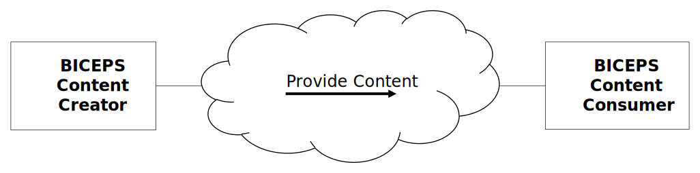

= Service-oriented Device Point-of-care Interoperability – Plug-and-trust (SDPi-P) Profile

// 10.
[sdpi_offset=10]
== Service-oriented Device Point-of-care Interoperability – Plug-and-trust (SDPi-P) Profile

The SDPi-Plug-and-trust ([[acronym_sdpi_p,SDPi-P]] SDPi-P) profile supports foundational seamless connectivity, information exchange and service invocation as defined in the SDPi architecture detailed in section #_2.X Service-oriented Device Point-of-care Interoperability (<<acronym_sdpi>>) – Overview & Framework_# above.
Whereas the related SDPi profiles for reporting, alerting and external control are explicitly intended to support medical care capabilities, the SDPi-P profile focuses on basic healthcare device interoperability.
All the capabilities defined in SDPi-P are leveraged by and extended in the medically focused profiles.
This foundational profile not only supports medical device interoperability ("<<acronym_mdi>>"), providing for “plug-and-play” capabilities, but also with a tightly integrated “trust” framework (see #_Appendix A –  Requirements Management for Plug-and-Trust Interoperability_#).
The establishment of a trusted ecosystem of medical and non-medical devices and applications footnote:[Note that SDPi-P supports application interoperability including “Software as a Medical Device” (<<acronym_samd>>).] begins at the start of discovery and a secure connection.  Therefore, the profile's name:  <<term_plug_and_trust>>.

_This_ is primarily an IHE transport profile footnote:[See the IHE Technical Frameworks General Introduction for a more detailed description of IHE profile types, published at https://profiles.ihe.net/GeneralIntro/[profiles.ihe.net/GeneralIntro/].], although it does define several content modules detailed in IHE Devices TF-3.
It supports the transactions and information exchanged in accordance to a Service-Oriented Architecture (SOA) specialized for high-acuity points of care (e.g., operating table or ICU bed), defined as a <<term_service_oriented_medical_device_system>>.
All the SDPi-P actors are therefore scoped with “<<acronym_somds>>” to clearly identify their application context and scope.

Although all information exchanged between SDPi-P <<acronym_somds>> participating systems and applications must conform to the basic <<acronym_sdc>>/<<acronym_biceps>> content module requirements footnote:[See <<vol3_clause_sdc_biceps_semantic_content_module>>. ], content modules have been defined for common high-acuity medical devices such as infusion pumps, ventilators and physiologic monitors.

Note that future IHE _workflow profiles_ may be defined that build upon the transport & content module foundation established by the SDPi-P profile.
For example, Operating Room / Surgery Point-of-Care Integration, ICU Point-of-Care Integration, or more service-focused profiles such as Point-of-Care Identity Management (PCIM) for device-patient association management, or Silent ICU & Quiet Hospital, where the acute point-of-care is integrated with enterprise systems around device alerting and alert distribution to provide an improved environment of care (reduced noise level and improved safety) and clinician interaction.

// 10.1
[#vol1_clause_sdpi_p_actors_transactions_content_modules,sdpi_offset=1]
=== SDPi-P Actors, Transactions, and Content Modules

[%noheader]
[%autowidth]
[cols="1"]
|===
a| *SDPi Supplement Version Note*: For SDPi 1.0 some actors and transactions have been deferred to a subsequent version, but are included here for completeness.
Specifically, actors:  SOMDS FHIR Gateway, SOMDS Sensor Gateway & SOMDS Smart App Platform, have been deferred.

Deferred transactions have been so indicated in the transactions table.

|===

This section defines the actors, transactions, and/or content modules in this profile.
General definitions of actors are given in the https://profiles.ihe.net/GeneralIntro/ch-A.html[_Technical Frameworks General Introduction Appendix A_].
IHE Transactions can be found in the https://profiles.ihe.net/GeneralIntro/ch-B.html[_Technical Frameworks General Introduction Appendix B_].
Both appendices are located at https://profiles.ihe.net/GeneralIntro/[_profiles.ihe.net/GeneralIntro_].

<<vol1_figure_sdpi_p_actor_diatram>> shows the actors directly involved in the SDPi-P Profile.
The relevant transactions between them are detailed in the subsequent #Table 10.1-1#.
Abstract Actors (i.e., those that provide common specifications that are utilized in other “concrete” or implementation actors) are indicated by stereotype names in italics (e.g., "<< _SOMDS_Participant_ >>".   The actors that inherit their capabilities include the stereotype at the top of their actor box.
Alternatively, in accordance with traditional IHE style, the abstract actor's name can be in italics with "{_abstract_}" (e.g., see _SOMDS Connector_ in #Figure 1# below).
Actor groupings, including abstract with concrete are detailed in #Section 10.3#.

[#vol1_figure_sdpi_p_actor_diatram]
.SDPi-P Actor Diagram

image::../images/vol1-diagram-sdpi-p-actor.svg[]

#Table 10.1-1# lists the transactions for each actor directly involved in the SDPi-P Profile.
To claim compliance with this profile, an actor shall support all required transactions (labeled “R”) and may support the optional transactions (labeled “O”).
Note that “Consumer” is indicated for actors that receive but do not directly respond to a specific transaction.

{empty} +

[%autowidth]
[cols="1,2,1,1,3"]
|===
.^|Actors
.^|Transactions
.^|Initiator or Responder
.^|Optionality
.^|Reference

| <<actor_somds_participant>>
| NOTE:  This abstract actor does not define any specific transactions.
| ...
| ...
| ...

.12+| <<actor_somds_provider>>
.^| <<transaction_name_announce_network_presence>>
.^| Initiator
.^| R
| <<vol2_clause_dev_23>>

| <<transaction_name_discover_network_topology>>
| Responder
| R
| <<vol2_clause_dev_24>>

| <<transaction_name_discover_biceps_services>>
| Responder
| R
| <<vol2_clause_dev_25>>

| <<transaction_name_discover_system_context_and_capabilities>> (_deferred_)
| Responder
| R
| Deferred to SDPi 1.x
// <<vol2_clause_dev_26>>

| <<transaction_name_manage_biceps_subscription>>
| Responder
| R
| <<vol2_clause_dev_27>>

| <<transaction_name_notify_change_in_system_context_and_capabilities>>
| Initiator
| O ^(See^ ^Note^ ^1)^
| <<vol2_clause_dev_28>>

| <<transaction_name_publish_biceps_update_reports>>
| Initiator
| R
| <<vol2_clause_dev_29>>

| <<transaction_name_retrieve_biceps_content>>
| Responder
| O
| <<vol2_clause_dev_30>>

| <<transaction_name_set_provider_state>> (_deferred_)
| Responder
| O
| Deferred to SDPi-xC
// <<vol2_clause_dev_31>>

| <<transaction_name_retrieve_archive_data>>  (_deferred_)
| Responder
| O
| Deferred to SDPi 1.x
// <<vol2_clause_dev_32>>

| <<transaction_name_retrieve_localization_information>>
| Responder
| O
| Deferred to SDPi 1.x
// <<vol2_clause_dev_33>>

| <<transaction_name_announce_network_departure>>
| Initiator
| R
| <<vol2_clause_dev_34>>

.12+| <<actor_somds_consumer>>
.^| <<transaction_name_announce_network_presence>>
.^| _Receiver_
.^| O
| <<vol2_clause_dev_23>>

| <<transaction_name_discover_network_topology>>
| Initiator
| R
| <<vol2_clause_dev_24>>

| <<transaction_name_discover_biceps_services>>
| Initiator
| R
| <<vol2_clause_dev_25>>

| <<transaction_name_discover_system_context_and_capabilities>> (_deferred_)
| Initiator
| R
| Deferred to SDPi 1.x
// <<vol2_clause_dev_26>>

| <<transaction_name_manage_biceps_subscription>>
| Initiator
| R
| <<vol2_clause_dev_27>>

| <<transaction_name_notify_change_in_system_context_and_capabilities>>
| Responder
| O
| <<vol2_clause_dev_28>>

| <<transaction_name_publish_biceps_update_reports>>
| Responder
| R
| <<vol2_clause_dev_29>>

| <<transaction_name_retrieve_biceps_content>>
| Initiator
| O
| <<vol2_clause_dev_30>>

| <<transaction_name_set_provider_state>> (_deferred_)
| Initiator
| O
| Deferred to SDPi-xC
// <<vol2_clause_dev_31>>

| <<transaction_name_retrieve_archive_data>>  (_deferred_)
| Initiator
| O
| Deferred to SDPi 1.x
// <<vol2_clause_dev_32>>

| <<transaction_name_retrieve_localization_information>>
| Initiator
| O
| Deferred to SDPi 1.x
// <<vol2_clause_dev_33>>

| <<transaction_name_announce_network_departure>>
| _Receiver_
| O
| <<vol2_clause_dev_34>>

| <<actor_somds_connector>>
| #TODO: TBD HOW TO REPLICATE TRANSACTIONS; ACTOR SUPPORTS ALL PROVIDER & CONSUMER TRANSACTIONS WITH SAME OPTIONALITY#
| ...
| ...
| ...

| <<actor_somds_fhir_gateway>> (_deferred_)
| ...
| ...
| ...
| ...

| <<actor_somds_v2_gateway>>
| #TODO: TBD HOW TO REPLICATE TRANSACTIONS#
| ...
| ...
| ...

| <<actor_somds_sensor_gateway>> (_deferred_)
| ...
| ...
| ...
| ...

| <<actor_somds_smart_app_platform>> (_deferred_)
| ...
| ...
| ...
| ...

5+<|
Note 1: _“Notify Change in System Context and Capabilities”_ is required if there are dynamic changes that may need to be sent to subscribing systems.

|===

{empty} +
{empty} +

#Figure 10.1-2# shows the content-related actors defined in the SDPi-P Profile and the direction that the content is exchanged.
In general, a SOMDS Provider<<actor_somds_provider>> actor will create content for consumption by a <<actor_somds_consumer>> actor; however, in the case of external control where a <<actor_somds_consumer>> actor is creating and sending content (e.g., patient demographics information) to a <<actor_somds_provider>> actor, the content module creator / consumer roles will be reversed.

A product implementation using this profile may group actors from this profile with actors from a workflow or transport profile to be functional.
The grouping of the content module described in this profile to specific actors is described in more detail in #10.3 SDPi-P Required Actor Groupings# or in #10.6 SDPi-P Cross Profile Considerations#.

{empty} +

.SDPi-P BICEPS Content Actor Diagram

#Table 10.1-2# lists the content module(s) defined in the SDPi-P Profile. To claim support with this profile, an actor shall support all required content modules (labeled “R”) and may support optional content modules (labeled “O”).

.SDPi-P -- Actors and Content Modules

[%autowidth]
[cols="1,1,1,1"]
|===
.^|Actors
.^|Content Modules
.^|Optionality
.^|Reference

.7+| <<actor_biceps_content_creator>>
| SDC/BICEPS Content Module
| R ^(See^ ^Note^ ^1)^
| <<vol3_clause_sdc_biceps_semantic_content_module>>

| Infusion Pump SDC/BICEPS Content Module
| O
| <<vol3_clause_device_infusion_pump>>

| Ventilator SDC/BICEPS Content Module
| O
| <<vol3_clause_device_ventilator>>

| Physiologic Monitor SDC/BICEPS Content Module
| O
| <<vol3_clause_device_physiological_monitor>>

| Surgery Devices SDC/BICEPS Content Module
| O
| <<vol3_clause_device_surgical>>

| Anesthesia Devices SDC/BICEPS Content Module (_deferred_)
| O
|

| Dialysis Devices SDC/BICEPS Content Module (_deferred_)
| O
|

.7+| <<actor_biceps_content_consumer>>
| SDC/BICEPS Content Module
| R ^(See^ ^Note^ ^1)^
| <<vol3_clause_sdc_biceps_semantic_content_module>>

| Infusion Pump SDC/BICEPS Content Module
| O
| <<vol3_clause_device_infusion_pump>>

| Ventilator SDC/BICEPS Content Module
| O
| <<vol3_clause_device_ventilator>>

| Physiologic Monitor SDC/BICEPS Content Module
| O
| <<vol3_clause_device_physiological_monitor>>

| Surgery Devices SDC/BICEPS Content Module
| O
| <<vol3_clause_device_surgical>>

| Anesthesia Devices SDC/BICEPS Content Module (_deferred_)
| O
|

| Dialysis Devices SDC/BICEPS Content Module (_deferred_)
| O
|

4+<|
Note 1: _All content exchanged on a SOMDS shall conform to the general SDPi “BICEPS Content Module” requirements (see <<vol3_clause_sdc_biceps_semantic_content>>).  <<actor_somds_provider>>-specific content modules (e.g., infusion pumps) may be optionally supported as indicated._

|===

// 10.1.1
==== Actor Descriptions and Actor Profile Requirements
SDPi-P actor roles and responsibilities are described in the subsections below.

Unless otherwise specified in these sections, specific transaction requirements are specified in in the #DEV TF-2 Transactions# volume, and requirements related to content modules are detailed in #DEV TF-3 DEV Semantic Content Modules#.
This section documents any additional requirements on the profile’s content actors.

The #following sequence diagram# illustrates a typical (not comprehensive) exchange scenarios between SDPi-P actors:

.SDPi-P Example Sequence Diagram
[[vol1_figure_sdpi_p_example_sequence_diagram]]
[plantuml, target=puml-sdpi-p-example-sequence-diagram, format=svg]
....
include::../plantuml/vol1-figure-sdpi-p-example-sequence-diagram.puml[]
....

#TODO:  IN THE FOLLOWING SECTIONS, SHOULD THE LINKS BE TO THE GLOSSARY APPENDIX OR TO THE ACTOR DEFINTION SECTIONS WHICH IN TURN CAN INCLUDE A LINK TO THE ACTORS APPENDIX?#

===== SOMDS Participant
Actor Summary Definition:
[none]
. A foundational abstract actor that provides the SOA architectural constructs for interoperating in a Service-Oriented Medical Device System (SOMDS) network instance, including information, messaging and dynamic behavior models.   (See <<ref_ieee_11073_10207_2017>>  “PARTICIPANT” definition)

All systems participating in a SOMDS network instance must implement this abstract actor.

All SDPi profiles actors are grouped with (inherit from) this actor, including both transport / transaction actors and content module actors.
This required grouping ensures that all systems connecting to a SOMDS network support the <<acronym_ses_mdi>>  requirements footnote:[See #TF-0  Appendix A for more detail on <<acronym_ses_mdi>>] necessary for establishing a <<term_plug_and_trust>> ecosystem, including the secure and dynamic provision of an implementation’s system function contribution (SFC).
See #A.3 Specifying SystemFunctionContribution (SFC) for Plug-and-Trust Interfaces# for more information.

===== SOMDS Provider
Actor Summary Definition:
[none]
. A <<actor_somds_participant>> that provides at least one service to the other participant systems.  (See <<ref_ieee_11073_10207_2017>>  “SERVICE PROVIDER” definition)

Every <<actor_somds_provider>> is paired with (inherits from) the abstract _<<actor_somds_participant>>_ actor.

A system that participates in a SOMDS network instance can include both <<actor_somds_consumer>> and <<actor_somds_provider>> actors.

===== SOMDS Consumer
Actor Summary Definition:
[none]
. A <<actor_somds_participant>> that discovers and utilizes at least one service, functional capability, exposed to a network communications backbone by a <<actor_somds_provider>>. (See <<ref_ieee_11073_10207_2017>>  “SERVICE CONSUMER” and “SERVICE” definitions.)

Every <<actor_somds_consumer>> is paired with (inherits from) the abstract _<<actor_somds_participant>>_ actor.

A system that participates in a SOMDS network instance can include both <<actor_somds_consumer>> and <<actor_somds_provider>> actors.

===== SOMDS Connector
Actor Summary Definition:
[none]
. A _<<actor_somds_participant>>_ that enables seamless interaction with systems and software applications that are outside the scope of the SOMDS network instance.  This abstract actor provides a consistent method for interacting, as a <<actor_somds_consumer>> and / or <<actor_somds_provider>>, with a specific SOMDS instance, as the foundation for protocol-specific gateway and platform actors.

Every abstract _<<actor_somds_connector>>_ actor is grouped with (inherits from) the abstract _<<actor_somds_participant>>_ actor.

A _<<actor_somds_connector>>_ can implement both <<actor_somds_consumer>> and <<actor_somds_provider>> actors.

In the case of a connector implementing a <<actor_somds_consumer>> actor, it is able to interact with other <<actor_somds_provider>> actors to either obtain information that is then made available to Non-SOMDS Systems or invoke services that are requested from the external Non-SOMDS Systems.
For example, forwarding patient respiratory rate readings to an external “flow sheet” application or invoking a device’s “pause alert audio” service when a clinician indicates they are responding to a physiological alert condition (e.g., high respiratory rate).

In the case of a connector implementing a <<actor_somds_provider>> actor, service capabilities for interacting with Non-SOMDS Systems are provided to the other networked <<actor_somds_consumer>> actors.
For example, an application that wants to retrieve patient information from an EHR or check the latest patient laboratory results.

Note that the term “connector” is used to allow for SOMDS interaction with other systems that do not require protocol “gateway” adaptation, but do require a consistent interface to the other participants within a SOMDS environment.
See #10.1.1.7 SOMDS Sensor Gateway# and #10.1.1.8 SOMDS Smart App Platform# for examples.

Each _<<actor_somds_connector>>_ gateway implementation will include the protocol-specific rules for connecting to and interacting with external Non-SOMDS Systems, including semantic mappings, message formats, and interaction sequences.
See related discussion at #DEV TF-3 8.2.8.7  SDC/BICEPS Mapping of SOMDS Connector Content Modules#.

Although the SDPi-P profile _<<actor_somds_connector>>_ actor provides for non-SOMDS _protocol-specific_ adaptors, they establish the foundation for specifying system and application-specific interfaces such as for EHR or decision support systems (e.g., sepsis determination). See #10.4.1.3 Ensuring Time Synchronization#, and #10.4.1.3 Aggregators, Proxies, Sensors# for additional perspectives and concepts on how SOMDS Connectors may be implemented.

_<<actor_somds_connector>>_ system implementations may support multiple protocols where there is one SOMDS-facing participant model or API but with multiple protocols for non-SOMDS system integration.
For example, a SOMDS “Alert” Gateway would interact with other _<<actor_somds_participant>>s_ in a single consistent way but may support both <<ref_hl7_fhir>> and <<ref_hl7_v2>> protocols for interacting with healthcare enterprise systems.

_<<actor_somds_connector>>_ actors are also utilized in other SDPi profiles for medical device information reporting (#SDPi-R#), alerting (#SDPi-A#) and external control (#SDPi-xC#). See those profile specifications for detailed usage.  In some cases, https://profiles.ihe.net/[IHE profiles] have been defined for supporting integration with Non-SOMDS Systems, such as the V2-based #IHE Devices Device to Enterprise Communication (DEC)# profile, or the #IHE ITI XDS-I# for locating and retrieving images for a specific patient using the #XDS.#b# profile.  In these cases, *_profile-specific_* _<<actor_somds_connector>>_ adaptors may be specified as well.

===== SOMDS FHIR Gateway
Actor Summary Definition:
[none]
. A _<<actor_somds_connector>>_ that supports use of <<ref_hl7_fhir>> for interoperating with Non-SOMDS Systems.

<<actor_somds_fhir_gateway>> actors shall be grouped with (inherit from) the abstract _<<actor_somds_connector>>_ actor.
They shall implement either a <<actor_somds_provider>> and / or <<actor_somds_consumer>> actor.

The <<actor_somds_fhir_gateway>> actor identifies and specifies the logic necessary for connecting a SOMDS network environment with Non-SOMDS Systems that utilize <<ref_hl7_fhir>> for their interoperability protocol.  Generally, this logic is defined in the HL7 <<ref_hl7_fhir_pocd_ig>>.

Gateways implementing this actor can support any of the FHIR architectural approaches:  RESTful, messaging, documents, and SOA.
For example, a <<actor_somds_fhir_gateway>> can utilize a <<actor_somds_consumer>> to retrieve information from other _<<actor_somds_participant>>_ systems, map it into FHIR Bundle resources and forward it on to non-SOMDS systems in a FHIR message.

Alternatively, the <<actor_somds_fhir_gateway>> could implement a FHIR server and provide support for systems to discover and retrieve information asynchronously, including the use of FHIR publication / subscription (“pub/sub”) services.

The <<actor_somds_fhir_gateway>> can also support SOMDS services invoked by FHIR-based systems, such as requesting a snapshot of the latest vital signs measurements for a specific patient and triggering a blood-pressure cuff reading.

===== SOMDS V2 Gateway

Actor Summary Definition:
[none]
. A <<actor_somds_connector>> that supports use of <<ref_hl7_v2>> for interoperating with Non-SOMDS Systems.

<<actor_somds_v2_gateway>> actors shall be grouped with (inherit from) the abstract _<<actor_somds_connector>>_ actor.
They shall implement either a <<actor_somds_provider>> and / or <<actor_somds_consumer>> actor.

The <<actor_somds_v2_gateway>> actor identifies and specifies the logic necessary for connecting a SOMDS network environment with Non-SOMDS Systems that utilize <<ref_hl7_v2>> for their interoperability protocol.
Since V2 is a message-based protocol, the primary implementation guide logic is defined in the #IHE DEV TF-2# appendices for V2 messaging, such as #Appendix B Common Segment Descriptions# and #Appendix C Common Data Types#.
The logic for semantic content modules is detailed in #IHE DEV TF-3#, including #8.2.8.3  SDC/BICEPS Relationship to Classic DIM#.

Generally, the <<actor_somds_v2_gateway>> actor supports messaging from a SOMDS environment to V2-enabled systems, utilizing a <<actor_somds_consumer>> actor to collect information from <<actor_somds_provider>> systems and translate them to V2 messages sent to other Non-SOMDS Systems.  There are cases, though, where information may be sent to a SOMDS-based system such as an alert conformation utilizing a #DEV-05 (i.e., PCD-05)# transaction (see the S#ervice-oriented Device Point-of-care Interoperability - Alerting (SDPi-A) Profile# below).

===== SOMDS Sensor Gateway
[%noheader]
[%autowidth]
[cols="1"]
|===
| *SDPi Supplement Version Note*: Detailed specifications for this actor are deferred to a later version of the SDPi Supplement.
|===

Actor Summary Definition:
[none]
. A _<<actor_somds_connector>>_  that supports integration of sensors external to a SOMDS network.

<<actor_somds_sensor_gateway>> actors shall be grouped with (inherit from) the abstract _<<actor_somds_connector>>_ actor.
They shall implement either a <<actor_somds_provider>> and / or <<actor_somds_consumer>> actor.

The <<actor_somds_sensor_gateway>> actor identifies and specifies the logic necessary for integration of signals and controls from small sensor and actuator devices that do not have the resources to support direct integration into a SOMDS network.
This includes integration of both wired and wireless sensor networks (“WSN”).
This also includes SOMDS integration of IoT (“Internet of Things”) architectures / networks.

===== SOMDS Smart App Platform
[%noheader]
[%autowidth]
[cols="1"]
|===
| *SDPi Supplement Version Note*: Detailed specifications for this actor are deferred to a later version of the SDPi Supplement.
|===

Actor Summary Definition:
[none]
. A _<<actor_somds_connector>>_  that supports connection to a SOMDS network that is optimized for applications, including <<term_software_as_a_medical_device>>.

<<actor_somds_smart_app_platform>> actors shall be grouped with (inherit from) the abstract _<<actor_somds_connector>>_ actor.
They shall implement either a <<actor_somds_provider>> and / or <<actor_somds_consumer>> actor.

This actor leverages the consistent integration of a _<<actor_somds_connector>>_ to a SOMDS network environment but provides a simplified platform specification to support “smart apps” including <<term_software_as_a_medical_device>>.
For example, an application may only need to identify and consume a few parameters from one or more _<<actor_somds_participant>>_ systems and not be required to implement a complete SOMDS interface including security, discovery, subscription management, filtering of unneeded <<acronym_mdib>> information, etc.

<<actor_somds_smart_app_platform>> actors provide an abstraction layer between application software and the requirements for interoperating in a SOMDS network backbone.
Since a single platform actor can support multiple Smart Apps, network traffic may be significantly reduced, as well as processing overhead for <<actor_somds_provider>> systems that have multiple <<actor_somds_consumer>>s simultaneously invoking their services.

The platform must support both non-smart app critical functions (such as network topology discovery and maintenance) but also aggregate app requirements (e.g., quality of service necessary to support an application’s algorithms).

See #10.4.1.5 Smart App Platforms# for additional discussion.

===== BICEPS Content Creator
Actor Summary Definition:
[none]
. Provides <<acronym_mdib>> content conformant to <<ref_ieee_11073_10207_2017>> BICEPS specification and for consumption by other <<actor_biceps_content_consumer>> systems.

All content created and provided by a <<actor_biceps_content_creator>> shall be conformant to the BICEPS content module specifications in #DEV TF-3 8.2.8.1  SDC/BICEPS Content Module# and related sections.

Note that although this SDPi-P content actor primarily supports information exchange between systems participating in a SOMDS network environment, they may also be utilized by other non-SDPi profiles that support non-SOMDS exchange architectures, transactions and technologies.

Content is provided by one _<<actor_somds_participant>>_ to another.
Typically, this will be a <<actor_somds_provider>> system to a <<actor_somds_consumer>> system; however, as noted previously, in some cases such as changing configuration settings within a <<actor_somds_provider>> (e.g., Patient Context), content creation and provision is from a <<actor_somds_consumer>> (initiating the configuration change request) to a <<actor_somds_provider>> system.

===== BICEPS Content Consumer
Actor Summary Definition:
[none]
. Processes <<acronym_mdib>> information conformant to <<ref_ieee_11073_10207_2017>> BICEPS specifications provided by <<actor_biceps_content_creator>> systems.

A <<actor_biceps_content_consumer>> actor shall be capable of processing information provided by a <<actor_biceps_content_creator>>, in accordance to the BICEPS content module specifications in #DEV TF-3 8.2.8.1  SDC/BICEPS Content Module# and related sections.
The supported BICEPS content processing shall include one or more of the options identified for this actor in #Table 10.2-1: SDPi-P – Actors and Options# below.

For robustness, a <<actor_biceps_content_consumer>> need only process the content that is necessary to support its capabilities, but shall also be able to accept and ignore any additional content that may be provided but is out-of-scope for its internal requirements. footnote:[Apply Postel’s Law:  Send conservatively, Accept liberally.]

Note that although this SDPi-P content actor primarily supports information exchange between systems participating in a SOMDS network environment, they may be referenced by other non-SDPi profiles that utilize other non-SOMDS exchange architectures, transactions and technologies.

// 10.2
=== SDPi-P Actor Options
Options that may be selected for each actor in this profile, if any, are listed in the #Table 10.2-1#.
Dependencies between options, when applicable, are specified in notes.

.SDPi-P – Actors and Options

[%autowidth]
[cols="^1,^1,^1"]
|===
.^|Actor
.^|Option Name
.^|Reference

| <<actor_somds_participant>>
| No options defined
|
|===

// 10.2.1
==== Streaming Option

// 10.2.2
==== Safe Data Transmission Option

// 10.2.3
==== Compact Representation Option

// 10.2.4
==== Patient Context Management Option

// 10.2.5
==== Archive Service Option

// 10.2.6
==== Localization Service Option

// 10.2.7
==== Ensemble Participation Option

// 10.3
=== SDPi-P Required Actor Groupings

#TODO:  ADD CT SOMDS_PARTICIPANT GROUPING + ATNA(?) ADD CONTENT FROM WORD DOCUMENT HERE; DO WE NEED TO ALSO CONSIDER GENERAL V2 AND DEV TF-2 APPENDIX A?#

// 10.4
=== SDPi-P Overview

// 10.4.1
==== Concepts

[#vol1_clause_sdpi_p_soa_somds_architecture_alignment]
===== SOA & SOMDS Architecture Alignment
#TODO: Link back to SDPi general overview at the top and how leveraged for SDPi-P Actors Model;  SOMDS Participant ABSTRACT actor role#

From a conceptual perspective, <<acronym_sdc>> implements a <<acronym_soa>> architecture for device-to-device <<term_plug_and_trust>> interoperability.  Consider <<figure_general_soa_model>>:

.General Service Oriented Architecture (SOA) Model
[#figure_general_soa_model]

This generalized model includes (3) system roles:

. *Service Providers* -- indicate the capabilities or services that they support, often published to a centralized registry that all participating systems recognize;

. *Service Registry* -- a <<acronym_soa>> network capability enabling participating systems to *_discover_* services provided by networked systems, as well as information for how a service consumer system can

#TODO: ADD --#

* #why somds#
* #distributed registry#
* #somds participant#
* #somds provider and consumer mappings#
* #same system can support both roles; all systems mush support participant#

NOTE:  A detailed overview of <<acronym_soa>> concepts is beyond the scope of this specification.  See <<vol1_appendix_b_references>> for additional background materials.

The <<acronym_sdc>> <<acronym_biceps>> standard, which SDPi-P profiles, consists of (3) core components, as illustrated in <<figure_sdc_biceps_components_model>>:

.SDC/BICEPS Components Model
[#figure_sdc_biceps_components_model]
image::../images/vol1-diagram-sdc-biceps-component-view.svg[align=center]

The <<term_medical_data_information_base>> component applies to all participating systems and consists of a *_descriptive model_* (e.g., what services and information a <<actor_somds_provider>> supports), and a state model.
The discovery and communications models combine to enable device-to-device messaging and to identify both systems and services available on the network.
The descriptive model is covered in more detail in <<vol3_clause_sdc_biceps_semantic_content_module>>, but the following <<figure_sdc_biceps_mdib_descriptors_states>> shows how network efficiency is achieved by searating descriptive information from dynamic state information:

.SDC/BICEPS MDIB Descriptors & States
[#figure_sdc_biceps_mdib_descriptors_states]

For every <<actor_somds_provider>> system, there is a descriptive model that includes a detailed specification of every element in the <<acronym_mdib>>.
For each Descriptor, though, there is a State element (note the inclusion of a State::DescriptorHandle), that can be used to determine the value and change status for the associated descriptor.
Therefore, though the <<acronym_mdib>> of a <<actor_somds_provider>> system must be retrieved at discovery and connection time, subsequent updates can be made upon state changes, greatly reducing network communication overhead.

An example of how <<acronym_biceps>> components (see <<figure_sdc_biceps_components_model>>) and <<acronym_mdib>> descriptors and states (see <<figure_sdc_biceps_mdib_descriptors_states>>) support <<term_plug_and_trust>> interoperability, see a typical conversation provided in <<vol1_figure_sdpi_p_example_sequence_diagram>>.

===== General Healthcare vs. Medical Interoperability Purposes
#TODO: All the transactions here are focused on healthcare information exchange with out any intended medical purpose; relationship to the other SDPi Profiles#

[#vol1_clause_sdpi_p_ensuring_time_synchronization]
===== Ensuring Time Synchronization
#TODO: This is a key topic for all health information exchange, and especially that of medical data.  A consuming system has to know, for example, that the time stamps provided in the BICEPS content or in the messages is accurate (and to what degree).  Requirements will be included HERE for SOMDS Participant & all other actors including BICEPS Content <xyz>.  Additional requirements may be added to the TF-3 BICEPS Content Module section as well.
Integration of CT and ATNA (TBD) below in required groupings is assumed but should be detailed here.#

#TODO: No time sync service identified in 11073 SDC core; include only in the SDPi-P section ... as a requirement to use NTP?; reference resolution of *TS Service*, *MD LAN*, in glossary entries#

===== Waveform Communication
#TODO:  Explain how waveforms are communicated, both snippets and especially "streaming"; include references to appropriate TF-2 & TF-3 Sections; this is part of the "DO WE NEED A WAVEFORM OPTION?" question to help end users? NO!!!  Could drop a note in TF-2 Appendix A for DEV-xyz and how RTSA/Waves would be transmitted / conveyed over the network#

===== Aggregators, Proxies, Sensors
##TODO: :  Include single / multiple patient variations.  See Topic on confluence; ultimately probably in TF-1 & -2 & -3.  NOTE added a section in TF-3 as well.
Mention SENSORS and WSN referencing SOMDS Sensor Gateways w/ rationale.
Include CLINICAL WORKPLACE SOMDS PROXY SERVICE …
NOTE:  This is not defined in 11073-20701 beyond clause 3. Definitions
See Gateways in the actors discussion above … and below?
##

===== Protocol-Specific Gateways
#TODO: :  External interfaces “gateways” defined in the abstract and in the protocol-specific.  These actors are leveraged in other profiles such as SDPi-Reporting for a DEC Gateway or in SDPi-Alerting for an ACM gateway.  Include proprietary protocols as well.
Given the discussion in Actors above, is this necessary here?  Or should some of that content be moved here?  YES … show examples for how the Actors might be grouped into a real-world gateway to … for example … an EHR etc.]#

===== Smart App Platforms
#TODO: 1.	This section enhances the short actor description above to describe in more detail the various aspects of an application “platform”; see Word draft section 10.4.1.5 for additional content#

===== Workflow vs. Transport Actors and Interactions
#TODO: discuss the challenges of drawing a line between transport profile actors in SDPi and applications of those actors in more care context / workflow applications, such as Smart Alarming or MDIRA/ICE or ICU Integration etc.  Reference TF-0 profile "types" - workflow vs. transport vs. content (???) ]#

===== SDC / BICEPS MDIB Versioning Management
#TODO: Where do we address profiling of MDIB versioning?  TF-1, TF-2 (e.g., in Appendix), TF-3 in MDIB content module?  Mix of all three?!#

// 10.4.2
==== Use Cases
The SDPi-P profile supports requirements from the use cases detailed in <<vol1_appendix_c_dpi_use_cases>>.  The following subsections identify the specific use case requirements that are fulfilled with capabilities provided by this profile.

#TODO:  For each of these, add discussion to HOW and WHERE (with links) that the requirements are met.  Include a Requirements usage block?  CT DEPENDENCY IN SOMDS_PARTICIPANT MEETS THESE REQUIREMENTS#

===== Synchronized Time Across Devices (STAD)
This profile fully addresses the requirements from  <<vol1_clause_appendix_c_use_case_stad>>.

Specific capabilities supporting the STAD profile include:

* *System Type*:  <<acronym_md_lan>> supported by SDPi-P <<acronym_pnt>> capabilities (see <<vol1_figure_sdpi_p_example_sequence_diagram>>)
* *Service Type*:  <<acronym_ts_service>> supported by *Consistent Time* profile binding (see <<vol1_clause_sdpi_p_ensuring_time_synchronization>>)
* *Technical Pre-Conditions*:  STAD <<vol1_clause_appendix_c_use_case_stad_technical_precondition>> are fully supported by SDPi-P
* *Scenarios*:  STAD <<vol1_clause_appendix_c_use_case_stad_scenarios>> are fully supported by SDPi-P

#TODO:  Should a sequence diagram be included here?  Or in above?  For each of the STAD Scenarios a sequence diagram should be provided.  This could include transactions and actor linkages as well#

===== Standalone ICU Dashboard Single Patient (SICDsp)
This profile provides capabilities for requirements from <<vol1_clause_appendix_c_use_case_sicdsp>>.

Specific capabilities supporting the SICDsp profile include:

* *System Type*:  <<acronym_md_lan>> supported by SDPi-P <<acronym_pnt>> capabilities (see <<vol1_figure_sdpi_p_example_sequence_diagram>>)
* *System Type*:  <<system_type_dashboard>> is supported by the BICEPS Content Module Systems Types Nomenclature (see <<vol1_table_system_type_nomenclature_extensions>>)
* *Technical Pre-Conditions*: SICDsp <<vol1_clause_appendix_c_use_case_sicdsp_technical_precondition>> are fully supported by SDPi-P
* *Scenarios*: SICDsp <<vol1_clause_appendix_c_use_case_sicdsp_scenarios>> basic communication requirements are supported by SDPi-P

#TODO:  Do SystemContext/PatientContext/LocationContext need to be called out here to meet requirements related to "ICU" or "single patient"?#

===== Standalone ICU Dashboard Multiple Patient (SICDmp)
This profile provides capabilities for requirements from  <<vol1_clause_appendix_c_use_case_sicdmp>>.

Specific capabilities supporting the SICDmp profile include:

* *System Type*:  <<acronym_md_lan>> supported by SDPi-P <<acronym_pnt>> capabilities (see <<vol1_figure_sdpi_p_example_sequence_diagram>>)
* *System Type*:  <<system_type_dashboard>> is supported by the BICEPS Content Module Systems Types Nomenclature (see <<vol1_table_system_type_nomenclature_extensions>>)
* *Technical Pre-Conditions*: SICDmp <<vol1_clause_appendix_c_use_case_sicdmp_technical_precondition>> are fully supported by SDPi-P
* *Scenarios*: SICDmp <<vol1_clause_appendix_c_use_case_sicdmp_scenarios>> basic communication requirements are supported by SDPi-P

#TODO:  Do SystemContext/PatientContext/LocationContext need to be called out here to meet requirements related to "ICU" or "multiple patient"?#

===== Device Data to Enterprise Systems (<<acronym_ddes>)
This profile provides capabilities for requirements from  <<vol1_clause_appendix_c_use_case_ddes>>.

Specific capabilities supporting the DDES profile include:

* *System Type*:  <<system_type_device_gateway>> is supported by the BICEPS Content Module Systems Types Nomenclature (see <<vol1_table_system_type_nomenclature_extensions>>)
* *Service Type*: Data  <<system_type_device_gateway>> Service is supported by the BICEPS Content Module Systems Types Nomenclature (see <<vol1_table_system_type_nomenclature_extensions>>)
* *Technical Pre-Conditions*: DDES <<vol1_clause_appendix_c_use_case_ddes_technical_precondition>> are fully supported by SDPi-P
* *Scenarios*: DDES <<vol1_clause_appendix_c_use_case_ddes_scenarios>> basic communication requirements are supported by SDPi-P

===== Alerts to Clinician Notification Systems (ACNS)
This profile provides capabilities for requirements from  <<vol1_clause_appendix_c_use_case_acns>>.

Specific capabilities supporting the ACNS profile include:

* *System Type*:  Alert <<system_type_device_gateway>> (AGW) is supported by the BICEPS Content Module Systems Types Nomenclature (see <<vol1_table_system_type_nomenclature_extensions>>)
* *Service Type*:  Alert <<system_type_device_gateway>> Service is supported by the BICEPS Content Module Systems Types Nomenclature (see <<vol1_table_system_type_nomenclature_extensions>>)
* *Technical Pre-Conditions*:  ACNS <<vol1_clause_appendix_c_use_case_acns_technical_precondition>> are fully supported by SDPi-P
* *Scenarios*:  ACNS <<vol1_clause_appendix_c_use_case_acns_scenarios>> basic communication requirements are supported by SDPi-P

===== Alerts to Alert Recording Systems (AARS)
This profile provides capabilities for requirements from  <<vol1_clause_appendix_c_use_case_aars>>.

Specific capabilities supporting the AARS profile include:

* *System Type*:  Alert <<system_type_device_gateway>> (AGW) is supported by the BICEPS Content Module Systems Types Nomenclature (see <<vol1_table_system_type_nomenclature_extensions>>)
* *Service Type*:  Alert <<system_type_device_gateway>> Service is supported by the BICEPS Content Module Systems Types Nomenclature (see <<vol1_table_system_type_nomenclature_extensions>>)
* *Technical Pre-Conditions*:  AARS <<vol1_clause_appendix_c_use_case_aars_technical_precondition>> are fully supported by SDPi-P
* *Scenarios*:  AARS <<vol1_clause_appendix_c_use_case_aars_scenarios>> basic communication requirements are supported by SDPi-P

// 10.5
=== SDPi-P Safety, Effectiveness, Security Considerations and Requirements

// 10.5.1
==== SES General Considerations

// 10.5.2
==== Safety Requirements & Considerations

// 10.5.3
==== Effectiveness Requirements & Considerations

// 10.5.4
==== Security Requirements & Considerations

// 10.6
=== SDPi-P Cross Profile Considerations

