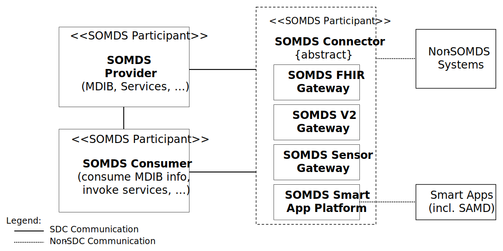

= Service-oriented Device Point-of-care Interoperability – Plug-and-trust (SDPi-P) Profile

NOTE:  This file contains the core Volume 1 specification for the SDPi-P profile.

// 10.
[sdpi_offset=10]
== Service-oriented Device Point-of-care Interoperability – Plug-and-trust (SDPi-P) Profile

The SDPi-Plug-and-trust ([[acronym_sdpi_p,SDPi-P]] SDPi-P) profile supports foundational seamless connectivity, information exchange and service invocation as defined in the SDPi architecture detailed in section #_2.X Service-oriented Device Point-of-care Interoperability (#SDPi#) – Overview & Framework_# above.
Whereas the related SDPi profiles for reporting, alerting and external control are explicitly intended to support medical care capabilities, the SDPi-P profile focuses on basic healthcare device interoperability.
All the capabilities defined in SDPi-P are leveraged by and extended in the medically focused profiles.
This foundational profile not only supports medical device interoperability ("<<acronym_mdi>>"), providing for “plug-and-play” capabilities, but also with a tightly integrated “trust” framework (see #_Appendix A –  Requirements Management for Plug-and-Trust Interoperability_#).
The establishment of a trusted ecosystem of medical and non-medical devices and applications footnote:[Note that SDPi-P supports application interoperability including “Software as a Medical Device” (<<acronym_samd>>).] begins at the start of discovery and a secure connection.  Therefore, the profile's name:  <<term_plug_and_trust>>.

_This_ is primarily an IHE transport profile footnote:[See the IHE Technical Frameworks General Introduction for a more detailed description of IHE profile types, published at https://profiles.ihe.net/GeneralIntro/[profiles.ihe.net/GeneralIntro/].], although it does define several content modules detailed in IHE Devices TF-3.
It supports the transactions and information exchanged in accordance to a Service-Oriented Architecture (SOA) specialized for high-acuity points of care (e.g., operating table or ICU bed), defined as a <<term_service_oriented_medical_device_system>>.
All the SDPi-P actors are therefore scoped with “<<acronym_somds>>” to clearly identify their application context and scope.

Although all information exchanged between SDPi-P <<acronym_somds>> participating systems and applications must conform to the basic <<acronym_sdc>>/<<acronym_biceps>> content module requirements footnote:[See #_DEV TF-3 8.2.8.1  SDC/BICEPS Content Module_#. ], content modules have been defined for common high-acuity medical devices such as infusion pumps, ventilators and physiologic monitors.

Note that future IHE _workflow profiles_ may be defined that build upon the transport & content module foundation established by the SDPi-P profile.
For example, Operating Room / Surgery Point-of-Care Integration, ICU Point-of-Care Integration, or more service-focused profiles such as Point-of-Care Identity Management (PCIM) for device-patient association management, or Silent ICU & Quiet Hospital, where the acute point-of-care is integrated with enterprise systems around device alerting and alert distribution to provide an improved environment of care (reduced noise level and improved safety) and clinician interaction.

// 10.1
[sdpi_offset=1]
=== SDPi-P Actors, Transactions, and Content Modules
This section defines the actors, transactions, and/or content modules in this profile. General definitions of actors are given in the https://profiles.ihe.net/GeneralIntro/ch-A.html[_Technical Frameworks General Introduction Appendix A_].
IHE Transactions can be found in the https://profiles.ihe.net/GeneralIntro/ch-B.html[_Technical Frameworks General Introduction Appendix B_].
Both appendices are located at https://profiles.ihe.net/GeneralIntro/[_profiles.ihe.net/GeneralIntro_].

#Figure 10.1-1# shows the actors directly involved in the SDPi-P Profile.
The relevant transactions between them are detailed in the subsequent #Table 10.1-1#.
Abstract Actors (i.e., those that provide common specifications that are utilized in other “concrete” or implementation actors) are indicated by stereotype names in italics (e.g., "<< _SOMDS_Participant_ >>".   The actors that inherit their capabilities include the stereotype at the top of their actor box.
Alternatively, in accordance with traditional IHE style, the abstract actor's name can be in italics with "{_abstract_}" (e.g., see _SOMDS Connector_ in #Figure 1# below).
Actor groupings, including abstract with concrete are detailed in #Section 10.3#.

#TODO:  SEE WORD EDITOR NOTES FOR POSSIBLE INCLUSION HERE#

#TODO:  ADD EDITORS TEXT BOX ABOUT SDPI 1.0 -- DEFERRED ACTORS / TRANSACTIONS -- WHY INCLUDED HERE#

.SDPi-P Actor Diagram

#Table 10.1-1# lists the transactions for each actor directly involved in the SDPi-P Profile.
To claim compliance with this profile, an actor shall support all required transactions (labeled “R”) and may support the optional transactions (labeled “O”).
Note that “Consumer” is indicated for actors that receive but do not directly respond to a specific transaction.

{empty} +

[%autowidth]
[cols="^1,^2,^1,^1,^3"]
|===
.^|Actors
.^|Transactions
.^|Initiator or Responder
.^|Optionality
.^|Reference

| <<actor_somds_participant>>
| #TODO: WHAT TO INCLUDE HERE WHEN THERE ARE NO SPECIFIC TRANSACTIONS???#
| ...
| ...
| ...

.12+| <<actor_somds_provider>>
.^| <<transaction_name_announce_network_presence>>
.^| Initiator
.^| R
| #DEV TF-2:3.23# <<vol2_clause_dev_23>>

| <<transaction_name_discover_network_topology>>
| Responder
| R
| #DEV TF-2:3.24# <<vol2_clause_dev_24>>

| <<transaction_name_discover_biceps_services>>
| Responder
| R
| #DEV TF-2:3.25# <<vol2_clause_dev_25>>

| <<transaction_name_discover_system_context_and_capabilities>>
| Responder
| R
| #DEV TF-2:3.26# <<vol2_clause_dev_26>>

| <<transaction_name_manage_biceps_subscription>>
| Responder
| R
| #DEV TF-2:3.27# <<vol2_clause_dev_27>>

| <<transaction_name_notify_change_in_system_context_and_capabilities>>
| Initiator
| O #^(See Note 1)^#
| #DEV TF-2:3.28# <<vol2_clause_dev_28>>

| <<transaction_name_publish_biceps_update_reports>>
| Initiator
| R
| #DEV TF-2:3.29# <<vol2_clause_dev_29>>

| <<transaction_name_retrieve_biceps_content>>
| Responder
| O
| #DEV TF-2:3.30# <<vol2_clause_dev_30>>

| <<transaction_name_set_provider_state>> (_deferred_)
| Responder
| O
| #DEV TF-2:3.31# <<vol2_clause_dev_31>>

| <<transaction_name_retrieve_archive_data>>  (_deferred_)
| Responder
| O
| #DEV TF-2:3.32# <<vol2_clause_dev_32>>

| <<transaction_name_retrieve_localization_information>>
| Responder
| O
| #DEV TF-2:3.33# <<vol2_clause_dev_33>>

| <<transaction_name_announce_network_departure>>
| Initiator
| R
| #DEV TF-2:3.34# <<vol2_clause_dev_34>>

.12+| <<actor_somds_consumer>>
.^| <<transaction_name_announce_network_presence>>
.^| _Receiver_
.^| O
| #DEV TF-2:3.23# <<vol2_clause_dev_23>>

| <<transaction_name_discover_network_topology>>
| Initiator
| R
| #DEV TF-2:3.24# <<vol2_clause_dev_24>>

| <<transaction_name_discover_biceps_services>>
| Initiator
| R
| #DEV TF-2:3.25# <<vol2_clause_dev_25>>

| <<transaction_name_discover_system_context_and_capabilities>>
| Initiator
| R
| #DEV TF-2:3.26# <<vol2_clause_dev_26>>

| <<transaction_name_manage_biceps_subscription>>
| Initiator
| R
| #DEV TF-2:3.27# <<vol2_clause_dev_27>>

| <<transaction_name_notify_change_in_system_context_and_capabilities>>
| Responder
| O
| #DEV TF-2:3.28# <<vol2_clause_dev_28>>

| <<transaction_name_publish_biceps_update_reports>>
| Responder
| R
| #DEV TF-2:3.29# <<vol2_clause_dev_29>>

| <<transaction_name_retrieve_biceps_content>>
| Initiator
| O
| #DEV TF-2:3.30# <<vol2_clause_dev_30>>

| <<transaction_name_set_provider_state>> (_deferred_)
| Initiator
| O
| #DEV TF-2:3.31# <<vol2_clause_dev_31>>

| <<transaction_name_retrieve_archive_data>>  (_deferred_)
| Initiator
| O
| #DEV TF-2:3.32# <<vol2_clause_dev_32>>

| <<transaction_name_retrieve_localization_information>>
| Initiator
| O
| #DEV TF-2:3.33# <<vol2_clause_dev_33>>

| <<transaction_name_announce_network_departure>>
| _Receiver_
| O
| #DEV TF-2:3.34# <<vol2_clause_dev_34>>

| <<actor_somds_connector>>
| #TODO: TBD HOW TO REPLICATE TRANSACTIONS; ACTOR SUPPORTS ALL PROVIDER & CONSUMER TRANSACTIONS WITH SAME OPTIONALITY#
| ...
| ...
| ...

| <<actor_somds_fhir_gateway>>
| #TODO: TBD HOW TO REPLICATE TRANSACTIONS#
| ...
| ...
| ...

| <<actor_somds_v2_gateway>>
| #TODO: TBD HOW TO REPLICATE TRANSACTIONS#
| ...
| ...
| ...

| <<actor_somds_sensor_gateway>>
| #TODO: TBD HOW TO REPLICATE TRANSACTIONS#
| ...
| ...
| ...

| <<actor_somds_smart_app_platform>>
| #TODO: TBD HOW TO REPLICATE TRANSACTIONS#
| ...
| ...
| ...

5+<|
Note 1: _“Notify Change in System Context and Capabilities”_ is required if there are dynamic changes that may need to be sent to subscribing systems.

|===

{empty} +
{empty} +

#Figure 10.1-2# shows the content-related actors defined in the SDPi-P Profile and the direction that the content is exchanged.
In general, a SOMDS Provider<<actor_somds_provider>> actor will create content for consumption by a <<actor_somds_consumer>> actor; however, in the case of external control where a <<actor_somds_consumer>> actor is creating and sending content (e.g., patient demographics information) to a <<actor_somds_provider>> actor, the content module creator / consumer roles will be reversed.

A product implementation using this profile may group actors from this profile with actors from a workflow or transport profile to be functional.
The grouping of the content module described in this profile to specific actors is described in more detail in #10.3 SDPi-P Required Actor Groupings# or in #10.6 SDPi-P Cross Profile Considerations#.

{empty} +

.SDPi-P BICEPS Content Actor Diagram

image::../images/vol1-diagram-sdpi-p-content-actor.svg[]

#Table 10.1-2# lists the content module(s) defined in the SDPi-P Profile. To claim support with this profile, an actor shall support all required content modules (labeled “R”) and may support optional content modules (labeled “O”).

#TODO:  ADD LINKS / LABELS TO THE FOLLOWING TABLE#

.SDPi-P -- Actors and Content Modules

[%autowidth]
[cols="^1,^1,^1,^1"]
|===
.^|Actors
.^|Content Modules
.^|Optionality
.^|Reference

.7+| <<actor_biceps_content_creator>>
| SDC/BICEPS Content Module
| R #^See Note 1^#
| #DEV TF-3: 8.2.8#  <<vol3_clause_sdc_biceps_semantic_content_module>>

| Infusion Pump SDC/BICEPS Content Module
| O
| #DEV TF-3: 8.3.1.4#

| Ventilator SDC/BICEP;S Content Module
| O
| #DEV TF-3: 8.3.2.4#

| Physiologic Monitor SDC/BICEPS Content Module
| O
| #DEV TF-3: 8.3.3.4#

| Surgery Devices SDC/BICEPS Content Module
| O
| #DEV TF-3: 8.3.4#

| Anesthesia Devices SDC/BICEPS Content Module
| O
| #DEV TF-3: 8.3.5#

| Dialysis Devices SDC/BICEPS Content Module
| O
| #DEV TF-3: 8.3.6#

.7+| <<actor_biceps_content_consumer>>
| SDC/BICEPS Content Module
| R #^See Note 1^#
| #DEV TF-3: 8.2.8#  <<vol3_clause_sdc_biceps_semantic_content_module>>

| Infusion Pump SDC/BICEPS Content Module
| O
| #DEV TF-3: 8.3.1.4#

| Ventilator SDC/BICEP;S Content Module
| O
| #DEV TF-3: 8.3.2.4#

| Physiologic Monitor SDC/BICEPS Content Module
| O
| #DEV TF-3: 8.3.3.4#

| Surgery Devices SDC/BICEPS Content Module
| O
| #DEV TF-3: 8.3.4#

| Anesthesia Devices SDC/BICEPS Content Module
| O
| #DEV TF-3: 8.3.5#

| Dialysis Devices SDC/BICEPS Content Module
| O
| #DEV TF-3: 8.3.6#

4+<|
Note 1: _All content exchanged on a SOMDS shall conform to the general SDPi “BICEPS Content Module” requirements (see <<vol3_clause_sdc_biceps_semantic_content>>).  <<actor_somds_provider>>-specific content modules (e.g., infusion pumps) may be optionally supported as indicated._

|===

// 10.1.1
==== Actor Descriptions and Actor Profile Requirements
SDPi-P actor roles and responsibilities are described in the subsections below.

Unless otherwise specified in these sections, specific transaction requirements are specified in in the #DEV TF-2 Transactions# volume, and requirements related to content modules are detailed in #DEV TF-3 DEV Semantic Content Modules#.
This section documents any additional requirements on the profile’s content actors.

The #following sequence diagram# illustrates a typical (not comprehensive) exchange scenarios between SDPi-P actors:

.SDPi-P Example Sequence Diagram
[[vol1_figure_sdpi_p_example_sequence_diagram]]
[plantuml, target=puml-sdpi-p-example-sequence-diagram, format=svg, reftext='{figure-caption} {counter:refnum}']
....
include::../plantuml/vol1-figure-sdpi-p-example-sequence-diagram.puml[]
....

===== SOMDS Participant

Actor Summary Definition:
[none]
. A foundational abstract actor that provides the SOA architectural constructs for interoperating in a Service-Oriented Medical Device System (SOMDS) network instance, including information, messaging and dynamic behavior models.   (See <<ieee_11073_10207_2017>>  “PARTICIPANT” definition)

All systems participating in a SOMDS network instance must implement this abstract actor.

All SDPi profiles actors are grouped with (inherit from) this actor, including both transport / transaction actors and content module actors.
This required grouping ensures that all systems connecting to a SOMDS network support the <<acronym_ses_mdi>>  requirements necessary for establishing a <<term_plug_and_trust>> ecosystem, including the secure and dynamic provision of an implementation’s system function contribution (SFC).
See #A.3 Specifying SystemFunctionContribution (SFC) for Plug-and-Trust Interfaces# for more information.

#TODO:  TODD STOPPED HERE 2022.11.09#

===== SOMDS Provider

Actor Summary Definition:
[none]
. A <<actor_somds_participant>> that provides at least one service to the other participant systems.  (See <<ieee_11073_10207_2017>>  “SERVICE PROVIDER” definition)

===== SOMDS Consumer

Actor Summary Definition:
[none]
. A <<actor_somds_participant>> that discovers and utilizes at least one service, functional capability, exposed to a network communications backbone by a <<actor_somds_provider>>. (See <<ieee_11073_10207_2017>>  “SERVICE CONSUMER” and “SERVICE” definitions.)

===== SOMDS Connector

Actor Summary Definition:
[none]
. A <<actor_somds_participant>> that enables seamless interaction with systems and software applications that are outside the scope of the SOMDS network instance.  This abstract actor provides a consistent method for interacting, as a <<actor_somds_consumer>> and / or <<actor_somds_provider>>, with a specific SOMDS instance, as the foundation for protocol-specific gateway and platform actors.

===== SOMDS FHIR Gateway

Actor Summary Definition:
[none]
. A <<actor_somds_connector>> that supports use of HL7 FHIR for interoperating with Non-SOMDS Systems.

===== SOMDS V2 Gateway

Actor Summary Definition:
[none]
. A <<actor_somds_connector>> that supports use of HL7 Version 2 (V2) for interoperating with Non-SOMDS Systems.

===== SOMDS Sensor Gateway

Actor Summary Definition:
[none]
. A _<<actor_somds_connector>>_  that supports integration of sensors external to a SOMDS network.

===== SOMDS Smart App Platform

Actor Summary Definition:
[none]
. A _<<actor_somds_connector>>_  that supports connection to a SOMDS network that is optimized for applications, including <<term_software_as_a_medical_device>>.

===== BICEPS Content Creator

Actor Summary Definition:
[none]
. Provides <<acronym_mdib>> content conformant to <<ieee_11073_10207_2017>> BICEPS specification and for consumption by other <<actor_biceps_content_consumer>> systems.

===== BICEPS Content Consumer

Actor Summary Definition:
[none]
. Processes <<acronym_mdib>> information conformant to <<ieee_11073_10207_2017>> BICEPS specifications provided by <<actor_biceps_content_creator>> systems.

// 10.2
=== SDPi-P Actor Options

// 10.2.1
==== Streaming Option
// NOTE:  These options are TBD for SDPi 1.0

// 10.3
=== SDPi-P Required Actor Groupings

// 10.4
=== SDPi-P Overview

// 10.4.1
==== Concepts

// 10.4.2
==== Use Cases

// 10.5
=== SDPi-P Safety, Effectiveness, Security Considerations and Requirements

// 10.5.1
==== SES General Considerations

// 10.5.2
==== Safety Requirements & Considerations

// 10.5.3
==== Effectiveness Requirements & Considerations

// 10.5.4
==== Security Requirements & Considerations

// 10.6
=== SDPi-P Cross Profile Considerations

