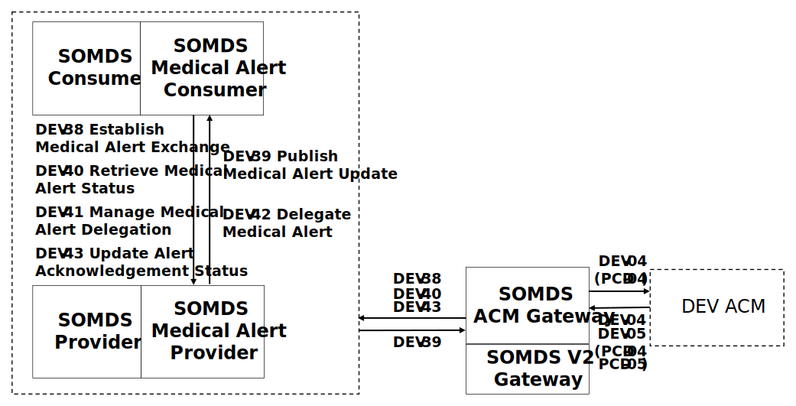

// = Service-oriented Device Point-of-care Interoperability - Alerting (SDPi-A) Profile

// 12.
[#vol1_clause_sdpi_a_profile,sdpi_offset=12]
== Service-oriented Device Point-of-care Interoperability - Alerting (SDPi-A) Profile

[%noheader]
[%autowidth]
[cols="1"]
|===
a| *SDPi Supplement Version Note*:  For SDPi 1.0 DEV Internal Review Version, this profile section remains fairly incomplete, with significant content needing to be migrated from the Word version of the supplement and then integrated into this AsciiDoc specification.
This will be completed in early January and *_an updated DEV Internal Review Version published by mid-January_*.

Note that the related transactions are completely defined in <<vol2_clause_transactions>>, and the <<actor_somds_acm_gateway>> is fully specified in <<#vol2_clause_appendix_sdpi_acm_gateway>>.
|===

The SDPi-Alerting ([[acronym_sdpi_a,SDPi-A]] SDPi-A) profile supports #TODO: add general description ...#

// 12.1
=== SDPi-A Actors, Transactions, and Content Modules

This section defines the actors, transactions, and/or content modules in this profile.
General definitions of actors are given in the https://profiles.ihe.net/GeneralIntro/ch-A.html[_Technical Frameworks General Introduction Appendix A_].
IHE Transactions can be found in the https://profiles.ihe.net/GeneralIntro/ch-B.html[_Technical Frameworks General Introduction Appendix B_].
Both appendices are located at https://profiles.ihe.net/GeneralIntro/[_profiles.ihe.net/GeneralIntro_].

<<vol1_figure_sdpi_a_actor_diagram>> shows the actors directly involved in the SDPi-A Profile.
The relevant transactions between them are detailed in the subsequent <<vol1_table_sdpi_a_actors_transactions>>.
Actor groupings, including abstract with concrete are detailed in <<vol1_clause_sdpi_a_required_actor_groupings>>.

[#vol1_figure_sdpi_a_actor_diagram]
.SDPi-A Actor Diagram

{empty} +

[#vol1_table_sdpi_a_actors_transactions]
.SDPi-A Profile - Actors and Transactions
[%autowidth]
[cols="1,2,1,1,3"]
|===
.^|Actors
.^|Transactions
.^|Initiator or Responder
.^|Optionality
.^|Reference

| ...
| #TABLE TO BE EXPANDED#
| ...
| ...
| ...

|===

// 12.1.1
==== Actor Descriptions and Actor Profile Requirements

// 12.2
=== SDPi-A Actor Options

// 12.2.1
==== tbd Option
// NOTE:  These options are TBD for SDPi 1.0

// 12.3
[#vol1_clause_sdpi_a_required_actor_groupings]
=== SDPi-A Required Actor Groupings

// 12.4
=== SDPi-A Overview

// 12.4.1
==== Concepts

// 12.4.2
==== Use Cases
The SDPi-A profile supports requirements from use cases detailed in <<vol1_appendix_c_dpi_use_cases>>.  The following subsections identify the specific use case requirements that are fulfilled with capabilities provided by this profile.

===== <<label_use_case_name_sicdsp>> (<<acronym_sicdsp>>)
This use case provides capabilities for requirements from <<vol1_clause_appendix_c_use_case_sicdsp>>.

Specific capabilities supporting the <<acronym_sicdsp>> use case include:

* *System Type*:  N/A
* *Service Type*:  N/A
* *Technical Pre-Conditions*: N/A
* *Scenarios*: <<acronym_sicdsp>> <<vol1_clause_appendix_c_use_case_sicdsp_scenarios>> communication of medical alert information to a <<actor_somds_consumer>> <<system_type_dashboard>>

===== <<label_use_case_name_sicdmp>> (<<acronym_sicdmp>>)
This use case provides capabilities for requirements from <<vol1_clause_appendix_c_use_case_sicdmp>>.

Specific capabilities supporting the <<acronym_sicdmp>> use case include:

* *System Type*:  N/A
* *System Type*:  N/A
* *Technical Pre-Conditions*: N/A
* *Scenarios*: <<acronym_sicdmp>> <<vol1_clause_appendix_c_use_case_sicdmp_scenarios>> communication of medical alert information to a <<actor_somds_consumer>> <<system_type_dashboard>>

===== <<label_use_case_name_acns>> (<<acronym_acns>>)
This use case provides capabilities for requirements from <<vol1_clause_appendix_c_use_case_acns>>.

Specific capabilities supporting the <<acronym_acns>> use case include:

* *System Type*:  N/A
* *Service Type*:  N/A
* *Technical Pre-Conditions*:  N/A
* *Scenarios*:  <<acronym_acns>> <<vol1_clause_appendix_c_use_case_acns_scenarios>> communication of medical alert information to a <<actor_somds_consumer>> Alert <<system_type_device_gateway>>

===== <<label_use_case_name_aars>> (<<acronym_aars>>)
This use case provides capabilities for requirements from <<vol1_clause_appendix_c_use_case_aars>>.

Specific capabilities supporting the <<acronym_aars>> use case include:

* *System Type*:  N/A
* *Service Type*:  N/A
* *Technical Pre-Conditions*:  N/A
* *Scenarios*:  <<acronym_aars>> <<vol1_clause_appendix_c_use_case_aars_scenarios>> communication of medical alert information to a <<actor_somds_consumer>> Alert <<system_type_device_gateway>>

[#vol1_clause_sdpi_a_ses_considerations]
=== SDPi-A Safety, Effectiveness, Security Considerations and Requirements

==== SES General Considerations
Requirements from the <<ref_iso_81001_1_2021>>, <<ref_iec_80001_1_2021>>, and related standards should be fully applied to this technical framework element.

For additional guidance, see section <<vol1_clause_appendix_a_ses_considerations_and_requirements>>.

==== Safety Requirements & Considerations
No additional safety requirements or considerations are identified for this technical framework element beyond those specified in the _<<acronym_ses>> General Considerations_ section above.

==== Effectiveness Requirements & Considerations
No additional effectiveness requirements or considerations are identified for this technical framework element beyond those specified in the _<<acronym_ses>> General Considerations_ section above.

==== Security Requirements & Considerations
No additional security requirements and considerations are identified for this technical framework element beyond those provided by the  SDPi-P profile (see <<vol1_clause_appendix_a_ses_considerations_section_template>>), and those specified in the _<<acronym_ses>> General Considerations_ section above.

// 12.6
=== SDPi-A Cross Profile Considerations

No cross profile considerations have been identified.

////
#TODO:  See the template instructions + PCD 2019 and other TF's to see if any content should go in this section for SDPi-A.#
////

