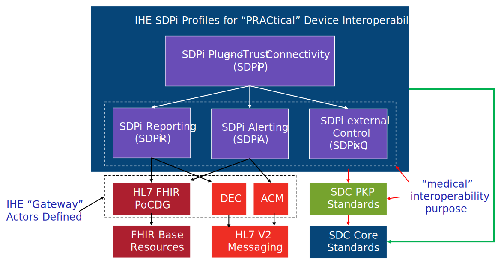

//= Devices Integration Profiles

// 2.
[#vol1_clause_devices_integration_profiles,sdpi_offset=2]
== Devices Integration Profiles

[%noheader]
[%autowidth]
[cols="1"]
|===
a| *SDPi Supplement Version Note*: This supplement is being written after the 2019 reorganization of the IHE Patient Care Devices (*PCD*) domain to the IHE Devices (*DEV*) domain.
It is intended to amend a new IHE DEV Technical Framework (TF), that covers the expanded areas not only of PCD devices (enterprise integration focused), but also Personal Connected Health (*PCH*) devices and Device Point-of-care Interoperability (*DPI*) for device-to-device integration around an acute point-of-care (e.g., operating room table, ICU bed, emergency department bed, etc.).
As a result of these basic changes in the scope and organization of the IHE DEV domain, some additional TF sections have been proposed to help the community understand how these technical specifications are integrated.  For example,

. Section(s) for General IHE Devices architecture, use contexts, and (4) <<term_participant_key_purposes>> functions -- Connecting, Reporting, Alerting, and Controlling (external)
. Section addressing "What is a device?" (aligned with a similar topic within the joint IHE-HL7 Gemini project); especially relevant given the differences between <<term_personal_health_device>> and <<term_point_of_care_device>> as well as the increasing prevalence of <<term_software_as_a_medical_device>> applications.  (See https://confluence.hl7.org/x/Iw7xB["Paper:  What is a device?"] for additional background)

These general concepts will help the technical framework reader understand the broader context into which the profile specifications are intended to be implemented.

*REVIEWER QUESTION*:

. Should the sections above be included in an updated IHE DEV TF specification?

. If so, should they be added in this SDPi Supplement or should they be added as a separate Change Proposal to the main IHE DEV TF (version 2022 or later)?

{empty} +
|===

// 2.2
[#vol1_clause_ses_considerations_requirements,sdpi_offset=2]
=== Safety, Effectiveness & Security Considerations and Requirements
IHE specifications often include sections for "Security Considerations" and "Safety Considerations", capturing both general and specific guidance and requirements for system implementers.
This supplement extends these two concepts to include a third:  Effectiveness.
The sections are termed: <<term_safe_effective_secure>> Considerations.

The background for <<acronym_ses>> is discussed in detail in <<vol1_appendix_a_integrating_ses>>; however, in general "<<acronym_ses>>" is used as a reference to the standards encompassed (directly and indirectly by reference) in <<term_joint_working_group_7>>, including <<ref_iso_81001_1_2021>> and <<ref_iec_80001_1_2021>>.
These standards are primarily, though not exclusively, focused on *_risk management of health software_* (including <<acronym_samd>>) *_and medical devices that are deployed on various kinds of infrastructure_*, with a focus to managing three key properties:  *Safety, Effectiveness and Security*.
Thus the "<<acronym_ses>> Considerations" sections in this supplement are intended to reflect the results of that risk management and to guide those who are tasked with deploying and managing these interoperable solutions during use.

Note that specific requirements from the above mentioned standards, may also be captured in section <<vol1_appendix_b_referenced_standards_conformance>> below.
Generally, requirements from these standards would be mapped to the appropriate <<acronym_ses>> Considerations sections throughout the specification.

// 2.3
[#vol1_clause_integration_profiles_overview]
=== Integration Profiles Overview

[%noheader]
[%autowidth]
[cols="1"]
|===
a| *SDPi Supplement Version Note*: The template for this section assumes that it will be integrated with the technical framework section that is organized based on TF-1 section headings (e.g., chapter 10 for SDPi- would have a summary here as 2.10.  No provision is made, though, for general introductory sections such as the SDPi Overview & Framework discussion below.

In this version, the content is added as 2.3.1, and then the profiles as 2.3.10 to 2.3.13.  Though the content is valid, it may be repositioned in subsequent versions to better integrate with the IHE DEV TF at a future date.

*_Omitted from this version are  profile-specific option summaries_* (e.g., 3.10.1 ?).  It is unclear where to best place this content, and they are listed explicitly in each profile's detailed specification.

|===

[#vol1_clause_sdpi_overview_framework]
==== Service-oriented Device Point-of-care Interoperability (SDPi) – Overview & Framework

The Service-oriented Device Point-of-care Interoperability (SDPi) profiles are built upon a foundation of standards and profiles from <<acronym_hl7>>, <<acronym_ieee>>, IHE and other organizations.  An overview of the profiles and their relationships is provided in <<figure_sdpi_profiles_foundational_standards>>.

.IHE SDPi Profiles & Foundational Standards
[#figure_sdpi_profiles_foundational_standards]

#TODO:  Introduce core concepts including -- SoA (graphic with distributed registry), D2D, Plug-and-Trust, PKPs, Gateways, rationale for (4) profiles (functionally and "medical" PKP), use context (high acuity point-of-care = "bed"), ... reference the hanging gardens model in Appendix A; include ICS Appendix B references too#

[sdpi_offset=10]
==== Service-oriented Device Point-of-care Interoperability - Plug-and-trust (SPDi-P) Profile
Within the framework of the SDPi architecture, the Plug-and-Trust ([[acronym_sdpi_p,SDPi-P]] SDPi-P) profile provides for *_secure plug-and-play connectivity_* between all actors.
The primary use context is acute care beds (e.g., ICU, operating room, emergency department), though it may be used in other healthcare contexts.
This profile provides for plug-and-trust (secured) communication for healthcare devices, systems and applications, regardless of whether they are "regulated" medical devices.
That said, the SDPi-P profile fully supports the safety and security requirements specified in the <<ref_ieee_11073_10700_2022>> Base <<acronym_pkp>> standard.
Other SDPi profiles provide direct support for _interoperable medical systems_.
Taking this approach allows non-medical technology to interact with other SDPi-enabled systems but without the added burden of having to support the more rigorous requirements associated with technology intended for a medical purpose (e.g., additional risk control mitigation measures).

The baseline profile supports core functionality needed by all participating systems; whereas, profile options are provided for those additional capabilities that may be added (e.g., "ensemble context" management).

[sdpi_offset=11]
==== Service-oriented Device Point-of-care Interoperability - Reporting (SPDi-R) Profile
The SDPi Reporting profile builds on the basic <<acronym_pnt>> capabilities of the <<acronym_sdpi_p>> profile, but adds the requirements to fully support *_medical data reporting_*.
To that end, this profile fully supports the safety and security requirements in the <<ref_ieee_11073_10701_2022>> metric reporting <<acronym_pkp>> standard.

The profile supports core medical data reporting functionality needed by all participating systems; whereas, profile options are provided for those additional capabilities that may be added.

[sdpi_offset=12]
==== Service-oriented Device Point-of-care Interoperability - Alerting (SPDi-A) Profile
The SDPi Alerting profile builds on the basic <<acronym_pnt>> capabilities of the <<acronym_sdpi_p>> profile, but adds the requirements to fully support *_medical alerting_*.
To that end, this profile implements the safety and security requirements of the <<ref_ieee_11073_10702_202x>> alert <<acronym_pkp>> standard (expected to be completed in 2023).

The profile supports core medical alerting functionality needed by all participating systems; whereas, profile options are provided for those additional capabilities that may be added (e.g., alert delegation).

#TODO:  Add "alert delegation" to the Glossary and reference here#

[sdpi_offset=13]
==== Service-oriented Device Point-of-care Interoperability - External Control (SPDi-xC) Profile

[%noheader]
[%autowidth]
[cols="1"]
|===
a| *SDPi Supplement Version Note*:  For SDPi 1.0, the SDPi-xC profile is provided for completeness and to show the general direction of the family of SDPi profiles.
It is *_not part of the capabilities specified for 1.0_* and even basic controls will not be added until SDPi 2.0 or later.
|===

The SDPi External Control profile builds on the basic <<acronym_pnt>> capabilities of the <<acronym_sdpi_p>> profile, but adds support for *_medical device external control capabilities_*.
For example, the ability to have a system initiate a blood pressure reading, or set a breath rate, or tritrate an infusion pump's delivery rate.
Given the significant risks associated with allowing device-external control functions in a network of <<acronym_pnt>> systems, this profile implements the safety and security requirements of the <<ref_ieee_11073_10703_202x>> external control <<acronym_pkp>> standard (in development, anticipated in 2023 or later).

[sdpi_offset=5]
=== Dependencies between Integration Profiles

[%noheader]
[cols="1"]
|===
| Add the following dependencies below to the IHE DEV TF Profile Dependencies table.
|===

#TODO:  SHOULD ATNA BE ADDED TO THIS TABLE FOR SOMDS_PARTICIPANT?#

[#vol1_table_devices_integration_profile_dependencies]
.Devices Integration Profile Dependencies

[%autowidth]
[cols="1,1,1,1"]
|===
.^|Integration Profile
.^|Depends on
.^|Dependency Type
.^|Purpose

| <<acronym_sdpi_p>>
| Consistent Time (CT)
| Each <<acronym_sdpi_p>> actor implementation (i.e., <<actor_somds_participant>>) shall be grouped with the CT Time Client actor.  Note:  All <<acronym_sdpi>> actors based on the <<actor_somds_participant>> actor.
| Required for consistent time-stamping of transactions and data.

| <<acronym_sdpi_r>>
| Device Enterprise Communication (DEC))
| The <<actor_somds_dec_gateway>> integrates DEC Device Observation Reporter (DOR) actor specifications
| Required for mapping from <<acronym_sdc>> & <<acronym_biceps>>  to HL7 V2 and DEC transactions.

| <<acronym_sdpi_a>>
| Alert Communication Management (ACM)
| The <<actor_somds_acm_gateway>> integrates ACM Alert Reporter (AR) actor specifications
| Required for mapping from <<acronym_sdc>> & <<acronym_biceps>>  to HL7 V2 and ACM transactions.

|===

#TODO:  DO WE NEED TO ALSO MENTION DOC IN AN SDPI 1.X NOTE?  WHAT ABOUT DEPENDENCY ON THE IHE DEV TF-2 APPENDIX A V2 GENERAL PROVISIONS?#
