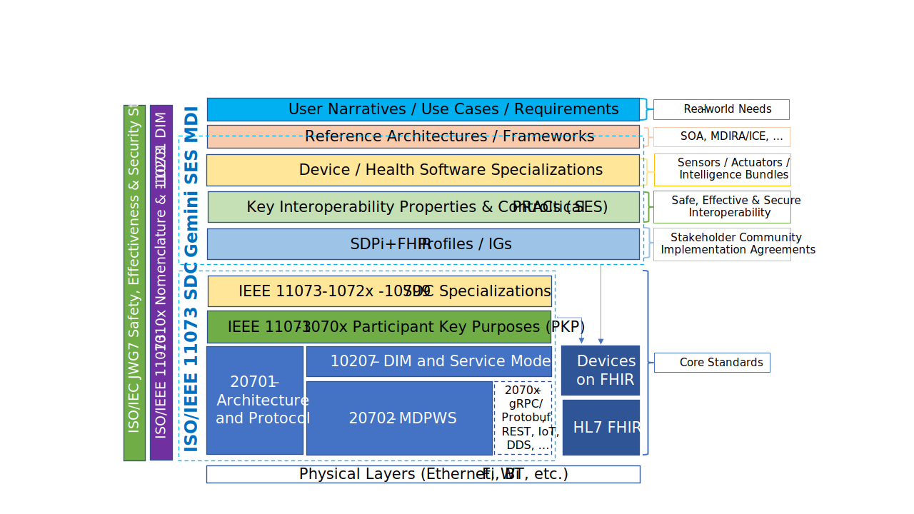

= Requirements Management for Plug-and-Trust Interoperability

NOTE:  This file contains general "articles" to help those trying to understand the metadata integtated into the spec to support advances such as "requirements interoperability". +
{empty} +
The content for this appendix may be pushed to SDPi 1.x.

// Appendix A
[appendix#vol1_appendix_a_requirements_management_for_p_n_t_interperability,sdpi_offset=A]
== Requirements Management for Plug-and-Trust Interoperability

// A.1
[sdpi_offset=1]
=== Requirements:  From Narratives to Plug-and-Trust Interfaces

.Hanging Gardens Framework

// A.2
=== Integrating Safety, Effectiveness & Security Requirements & Considerations

