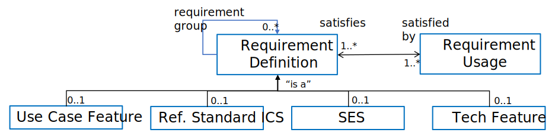

= Requirements Management for Plug-and-Trust Interoperability

NOTE:  This file contains general "articles" to help those trying to understand the metadata integtated into the spec to support advances such as "requirements interoperability". +
{empty} +
The content for this appendix may be pushed to SDPi 1.x.

// Appendix A
[appendix#vol1_appendix_a_requirements_management_for_p_n_t_interperability,sdpi_offset=A]
== Requirements Management for Plug-and-Trust Interoperability

// A.1
[sdpi_offset=1]
=== Requirements:  From Narratives to Plug-and-Trust Interfaces

.Hanging Gardens Framework

image::../images/vol1-diagram-hanging-gardens.svg[]

#TODO:  ADD INTEROPERABILITY PATHS EXAMPLE VIA A TABLE (VS. LINES THROUGH GRAPHIC)#

// A.2
=== Integrating Safety, Effectiveness & Security Requirements & Considerations

.ISO/IEC 81001-1 The Temple Diagram

image::../images/vol1-diagram-81001-temple.svg[algin=center]

#TODO:  SHOULD THE FOLLOWING SOURCE LINE BE A FOOTNOTE ... HUNG ON WHERE ... IHE CONVENTION?#

Source:  <<iso_81001_temple>>

=== SDPi Requirements Modeling & Integration

As pointed out above, requirements interoperability (RI) based on robust model-based metadata is a core, innovative aspect of this SDPi profiles specification.  Given the ultimate intent to realize this description as a _Model Centric (MC) single-source-of-truth, computable, simulatable, verifiable and validatable system of systems interoperability specification_, and recognizing that it will take a significant transition period from a document-centric approach to a model-centric approach, a simplified requirements model is provided below but is aligned with the <<omg_sysml_2-0_spec>> section 7.20 Requirements language.  Of course, that specification provides for significantly more detailed and complext modeling, the general constructs may be used in this document to start the transition toward that model.  Note that SysML 2.0 also better supports model interoperability (tool-independent model exchange) and _Model-based Systems Engineering (MBSE)_ (see https://en.wikipedia.org/wiki/Model-based_systems_engineering[MBSE Wikipedia article and references]), as well as the <<ihe_eu_experience_2021_presentation_cooper_schlichting>> for an overview presentation of MBSE, MedTech system V&V, and IHE Conformity Assessment.

It should be further noted that though conformity testing aspects are beyond this SDPi specification, the modeling constructs used below will also be integrated with <<omg_sysml_2-0_spec>> section 7.23 Verification Cases, to provide for advanced V&V of interoperable system components and entire systems of products.

==== SDPi Requirements Core Model

To formally integrate requirements in to this specification, the following requirements model provides the starting point:

.SDPi Requirements - Core Model

This model identifies a set of requirement "types" that are formalized in the specification.  Each type is a source of requirements that are explicitly identified and formalized with appropriate metadata.

[%autowidth]
[cols="^1,4,^1,^1"]
|===
|Model Element |Description |AsciiDoc Attribute |Further Specified

| SDPi Requirement
| A defined stakeholde-imposed constraints that must be satisfied for a design solution to be valid.  This is an {abstract} element.
| sdpi_requirement
| See subtypes

| SDPi Requirement Group
| Two or more SDPi Requirements may be collected into a group that is focused around a specific _subject_ area.
| sdpi_requirement_group
|

| Usage
| Requirement utilized in a specific use context that provides for its satisfaction.
| sdpi_requirement_usage
| 

| Use Case Feature
| A functional "feature" requirement based on clinical use case scenarios.
| mdi_requirement_use_case
| See TF-1 Appendix C, gherkin model

| Ref. Standard ICS
| Requirement definitions that are specified in a normative reference.
| sdpi_requirement_ref_standard
|

| SES
|
| sdpi_requirement_ses
| See SES section ... WHERE IS THAT?

| Tech Feature
|
| sdpi_requirement_tech_feature
|
|===

#show core data elements for this abstract SDPi Requirement Definition #

#note navigating relationships from usage to requirements supports traceability from capabilities / feature verification back to source requirements and group coverage#

==== Alignment with SysML 2.0 Requirements Modeling
TODO:

. Include UML Model for requirements type
. Link to SysML 2.0 ... specific sections

. Include SysML 2.0 concepts
** requirement => SDPi Requirement

** *requirement def* (stereotype) -> compartments:
*** identifier"doc" (shall / should / may)
*** (optional attributes)
*** "constraints" -> "require" \{expression}  OR "assume" \{expression}
**** constraint is an expression that can be evaluated TRUE or FALSE ... #testable *Assertion*#!!!  an "assert constraint usage" (7.19)
**** satisfy <requirement def>

** requirement #group# - can own/ref other requirements -> SDPi Requirement Group
*** subject
*** containment / reference list

NOTE: Verification Cases will be used to perform verification of "satisfy" usage of defined requirements
