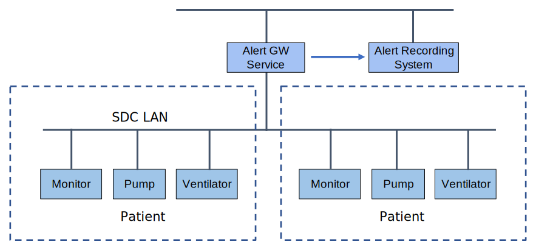

// = Use Case Feature: Alerts to Alert Recording Systems (AARS)

[sdpi_offset=7]
=== Use Case Feature {var_use_case_id}: Alerts to Alert Recording Systems (AARS)

==== Narrative:

#TODO:  Add narrative text#

==== Technical View

.Alerts to Alert Recording Systems (AARS) -- Technical View

==== Technical Pre-Conditions

*Given* ...

*And* ...

==== Scenarios

===== Scenario: AARS {var_use_case_id}.1 - ...

*Given* ...

*When* ...

*Then* ...

