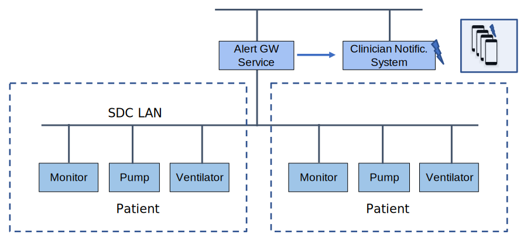

// = Use Case Feature: Alerts to Clinician Notification Systems (ACNS)

[sdpi_offset=6]
=== Use Case Feature {var_use_case_id}: Alerts to Clinician Notification Systems (ACNS)

==== Narrative:

Bonjour Hospital is in the process of installing a nurse alert notification system which will communicate alerts from the ICU devices (patient monitors, ventilators, infusion devices, etc.) directly to nurse devices such as pagers or smartphones.  Bobby Thornton is responsible for integrating data from their ICU devices with the alert notification system.  Once they are done, the alerts from the devices will be forwarded by the gateway to the nurse devices for viewing in a timely manner.

==== Technical View

.Alerts to Clinician Notification Systems (ACNS) -- Technical View

==== Technical Pre-Conditions

*Given* All devices communicate using a common MD LAN protocol

*And* At least one Alert Gateway (AGW) Service on the MD LAN network

*And* At least one Clinical Notification System is connected to the AGW Service.

*And* All devices report either a device label and/or location and/or patient ID

*And* The AGW Service is associated with a specific set of device labels, and/or location(s) (Scope)

==== Scenarios

===== Scenario: ACNS {var_use_case_id}.1 - New device is connected to network with AGW service

*Given* the AGW Service has detected a new device in its scope

*When* the AGW Service is operational

*Then* the AGW Service will connect to the device and communicate alerts to the Clinician Notification System

===== Scenario: ACNS {var_use_case_id}.2 - The AGW service loses connectivity with the ICU devices

*Given* the AGW Service no longer communicates with ICU devices in its scope

*When* There is a communications failure

*Then* the AGW Service will notify the Clinician Notification System of the failure

*Then* when the AGW Service regains communication with the devices it will resume reporting active alerts to the Clinician Notification System

===== Scenario: ACNS {var_use_case_id}.3 - The AGW service fails

*Given* the AGW Service fails

*Then* the Clinician Notification System will detect a loss of communications with the AGW Service

*Then* when the AGW Service recovers it will resume reporting active alerts to the Clinician Notification System

===== Scenario: ACNS {var_use_case_id}.4 - The Clinician Notification System loses connectivity with the AGW

*Given* the Clinician Notification System can no longer communicate with the AGW Service

*Then* the Clinician Notification System will detect a loss of communications with the AGW Service

*Then*  when connectivity recovers, the Clinician Notification System will resume reporting active alerts

