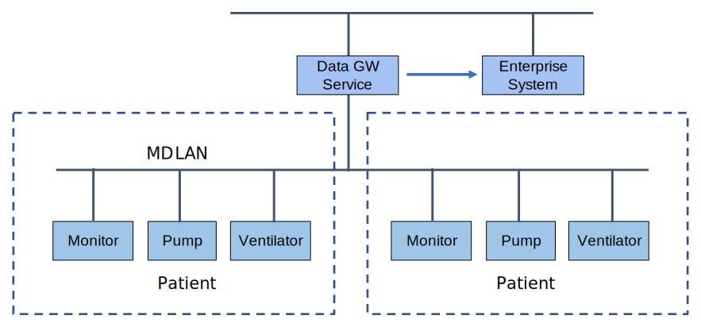

// = Use Case Feature: Device Data to Enterprise Systems (DDES)

[sdpi_offset=5]
=== Use Case Feature {var_use_case_id}: Device Data to Enterprise Systems (DDES)

==== Narrative:

Mercy Hospital is in the middle of a new EHR (Epic, Cerner, etc.) rollout.  Joe Furst is responsible for integrating data from their ICU devices (patient monitors, ventilators, infusion devices, etc.) with the new EHR.  Once they are done, the data from the devices will be reviewed/validated by the ICU clinicians and then automatically entered into the patient’s clinical record.

==== Technical View

.Device Data to Enterprise Systems (DDES) -- Technical View

==== Technical Pre-Conditions

*Given* All devices communicate using SDC

*And* There is at least one Data Gateway Service

*And* All devices report either a device label and/or location

*And* A Data Gateway is associated with a specific set of device labels, and/or location(s) (i.e. devices in scope).

==== Scenarios

===== Scenario: DDES {var_use_case_id}.1 - New in scope device is connected to network with MGW service

*Given* Data Gateway service has detected a new in scope device

*When* the Data Gateway service is operational

*Then* the Data Gateway service will connect to the device and export data to the EHR using the HL7 v2 based IHE DEV DOR actor of the DEV DEC profile

===== Scenario: DDES {var_use_case_id}.2 - Data Gateway Service is connected to the EHR

*Given* Data Gateway is exporting data to the EHR

*Then* the Data Gateway service will comply with all IHE DEV DEC profile DOR actor functional and test requirements.

===== Scenario: DDES {var_use_case_id}.3 - Data Gateway Service has a failure

*Given* the Data Gateway service was connected to in scope devices and to an Enterprise system and fails

*Then* the Data Gateway service will backfill its data store and then backfill to the EHR when it recovers from its failure

===== Scenario: DDES {var_use_case_id}.4 - Data Gateway Service connection to the Enterprise System fails

*Given* the Enterprise System stops receiving data from the Data Gateway Service

*When* There is a communications failure between the Data Gateway and the Enterprise System

*Then* the Data Gateway service will backfill missed data to the Enterprise System when communications resumes

