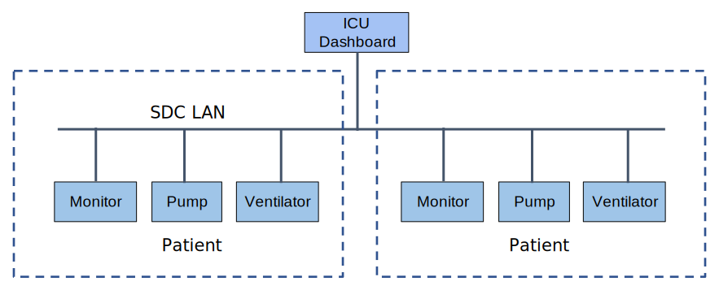

// = Use Case Feature: Standalone ICU Dashboard MP (SICDMP)

[sdpi_offset=4]
=== Use Case Feature {var_use_case_id}: Standalone ICU Dashboard MP (SICDMP)

==== Narrative:

#TODO:  Add narrative text#

==== Technical View

.Standalone ICU Dashboard MP (SICDMP) -- Technical View

==== Technical Pre-Conditions

*Given* ...

*And* ...

==== Scenarios

===== Scenario: SICDMP {var_use_case_id}.1 - ...

*Given* ...

*When* ...

*Then* ...

