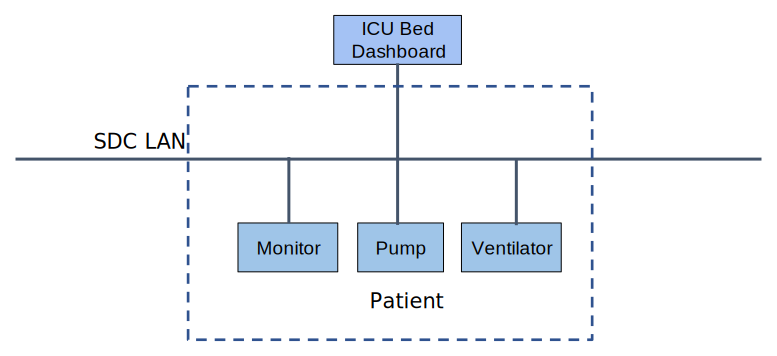

// = Use Case Feature: Standalone ICU Dashboard SP (SICDsp)

[sdpi_offset=3]
=== Use Case Feature {var_use_case_id}: Standalone ICU Dashboard Single Patient (SICDsp)

==== Narrative:

Dr. Reich is in one of her patient’s ICU room checking on their status. She can view previous radiology results, electrosurgical equipment settings, patient readings such as HR, Blood Pressure, SpO2 and associated waveforms integrated on his real-time ‘Dashboard’ display.  The dashboard display can display visual alarms but does not sound alerts or provide any remote-control capabilities.  (This display can be considered an xDISsp as described in <<vol1_appendix_c_60601_1_8_concepts_for_dis_das_cdas>>.)

==== Technical View

.Standalone ICU Dashboard SP (SICDSP) -- Technical View

==== Technical Pre-Conditions

*Given* All devices communicate using SDC

*And* At least one ICE Dashboard display

*And* Devices in the room have already been assigned to the Dashboard

==== Scenarios

===== Scenario: SICDsp {var_use_case_id}.1 - Devices are Accessible to the Dashboard

*Given* Dashboard has detected at least one assigned accessible ICU device

*When* the ICU devices are "On"

*Then* the Dashboard will display parameter, waveform, alarm, setting, imagine, etc. information from all assigned accessible devices

===== Scenario: SICDsp {var_use_case_id}.2 - ICU Devices are Inaccessible to the Dashboard

*Given* Dashboard cannot detect any assigned accessible ICU devices

*Then* the Dashboard will display an error message

===== Scenario: SICDsp {var_use_case_id}.3 - One or more ICU devices become Inaccessible to the Dashboard

*Given* Dashboard cannot detect a previously detected assigned ICU device

*Then* the Dashboard will display an error message

