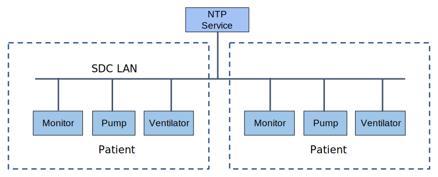

// = Use Case Feature: Synchronized Time Across Devices (STAD)

#TODO:  Add use case metadata strategy#

// [mdi_use_case#use_case_stad,actors='actor_somds_provider actor_somds_consumer',figure=vol2_figure_dev_24_probe_sequence,messages='message_announce_network_presence']

// FROM TF-2 DEV-24 Transaction document
// [sdpi_transaction#transaction_dev_24,actors='actor_somds_provider actor_somds_consumer',figure=vol2_figure_dev_24_probe_sequence,messages='message_announce_network_presence']

[sdpi_offset=2]
=== Use Case Feature {var_use_case_id}: Synchronized Time Across Devices (STAD)

==== Narrative:
Nurse Jean attaches a ventilator to the SDC based network in the ICU.  It automatically synchronizes its clock with the clocks of the other devices on the network.

==== Technical View

.Synchronized Time Across Devices (STAD) -- Technical View

==== Technical Pre-Conditions

*Given* All devices communicate using SDC

*And* NTP service on the SDC network

==== Scenarios

===== Scenario: STAD {var_use_case_id}.1 - Device is connected to network with NTP service

*Given* Device has detected at least one NTP service

*When* The NTP service is operational

*Then* The device will synchronize its time with the NTP service time

===== Scenario: STAD {var_use_case_id}.2 - Device is connected to network with a failed NTP server

*Given* Device has not detected at least one NTP service

*When* The NTP service is not operational or inaccessible

*Then* The device will synchronize its time with another SDC device in the cluster

===== Scenario: STAD {var_use_case_id}.3 - Device is connected to network with NTP server and a second device’s time setting is changed manually

*Given* Device has detected at least one NTP service

*When* The NTP service is operational

*And* The time at another device is changed manually (maybe this is disallowed?)

*Then* The device will continue to synchronize its time with the NTP service time

===== Scenario: STAD {var_use_case_id}.4 - Device is connected to network with a failed NTP server and a second device’s time setting is changed manually

*Given* Device has not detected at least one NTP service

*When* The NTP service is not operational or inaccessible

*And* The time at another device is changed manually

*Then* The device will synchronize its time with the time from the SDC device that had its time changed

